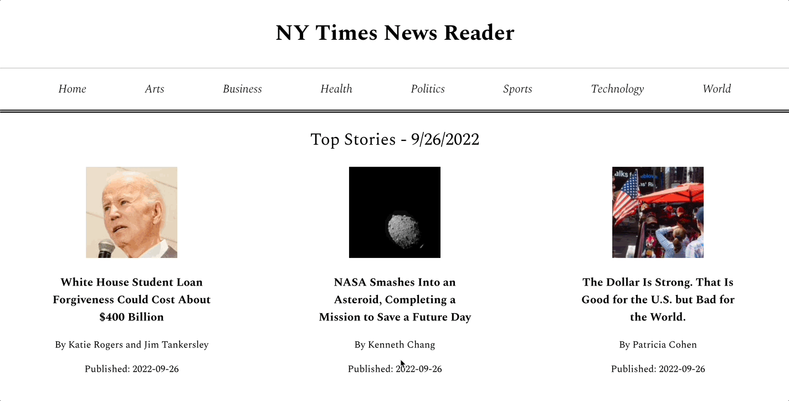
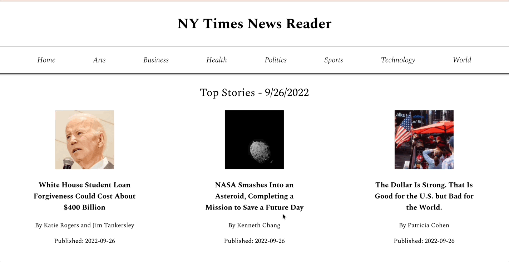

# NY Times News Reader

## Overview
**NY Times News Reader** is a website that allows for a user to view a selection of top news stories from the [New York Times API Top Stories API](https://developer.nytimes.com/docs/top-stories-product/1/overview). The user can view brief information about these stories in a grid format. They can then click on one story to find out more information and be linked to the actual article. The website also gives the user options to filter top stories by certain topics. It is available for use on mobile devices, tablets, and computers.

#### Goals & Specs
- The goal was to build out a minimum viable product with clean code in an 8-hour time limit using React JS and front-end best practices
- The rubric and specs can be found [here](https://mod4.turing.edu/projects/take_home/take_home_fe)

## Set Up
1. Fork this [repository](https://github.com/kpn678/ny-times), and clone it into your local machine.
2. Navigate into the repository and run `npm install` from your command line.
3. To view the app running inside the local host, run `npm start`.

## Visual Walkthrough
- User can view a list of top stories from the New York Times

- User can filter top stories by different topics

- User can view more information about a specific story and be directed to the actual article

## Technologies Implemented
- Javascript/HTML (JSX)
- CSS
- React
- React Router

## Future Directions
- Improve error handling
- Conduct Cypress testing for both happy and sad path user flows
- Add more CSS to make it resemble more of inspiration pieces ([The New York Times](https://www.nytimes.com/), [The Wall Street Journal](https://www.wsj.com/), [BBC](https://www.bbc.com/))
- In terms of doing a timed take-home challenge again, improve on ability to timebox

## Contributors
- [Kristy Nguyen](https://www.linkedin.com/in/kristypnguyen/)